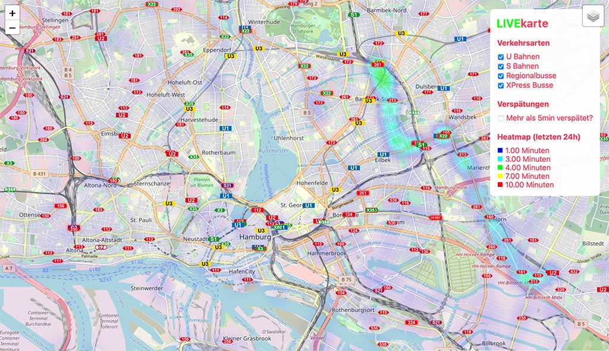
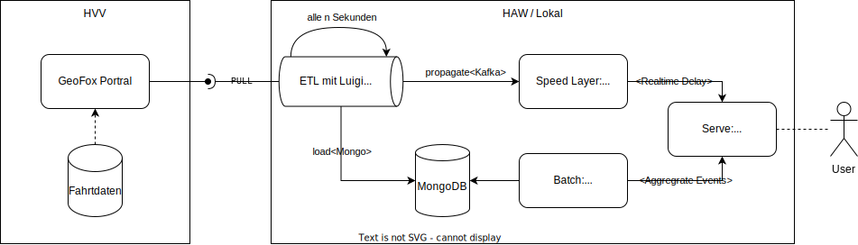

# HVV Live Karte mit Verspätungen

Mit Hilfe der kostenlosen [HVV API](https://www.hvv.de/de/fahrplaene/abruf-fahrplaninfos/datenabruf) können mit diesem Projekt die Fahrten und Verspätungen der HVV Live in Hamburg auf einer Karte projiziert werden, um mögliche Einflüsse von Ereignissen (z.B. Wetter, Fußballspiele, Dom, etc.) zu analysieren. Dabei wird automatisch eine Heatmap der bereits gespeicherten Ereignisse erzeugt.

> [!NOTE]
> Das Projekt ist im Rahmen des Moduls "Datenmanagement und Algorithmen für Big Data" im Studiengang "Master Informatik" der [HAW Hamburg](https://www.haw-hamburg.de) entstanden und hat **nichts** mit der HVV zu tun.

**Demo (Bild)**



## Installation

Zunächsten sollten Einstellungen als Umgebungsvariablen in der ```sample.env``` gesetzt werden. Im Anschluss wird diese in ```.env``` umbenannt. Dann sollten alle Dependencies installiert werden:

```pip install -r requirements.txt```

### Kubernetes

#### 1) Komponenten deployen:

```
cd ./deployment/k8s/kafka
kubectl apply -f 01-zookeeper-deployment.yaml
kubectl apply -f 02-broker-deployment.yaml
cd ../mongo
kubectl apply -k .
```

#### 2) Portforward für die Kubernetes Dienste:

```kubectl port-forward <POD-NAME-DES-BROKERS> 9092```

> [!IMPORTANT]
> * IP Adresse des Zookeepers (```kubectl get services```) muss in der 02-broker-deployment.yaml in der jeweiligen Zeile ergänzen
> * In der ```/etc/hosts``` muss folgende Zeile ergänzt werden: ```127.0.0.1 kafka-broker``` 


### Docker

Requriements:
* Docker
* Docker-Compose

#### 1) Mongo Container starten

```
cd ./deployments/docker/
docker-compose -f mongo.yml up -d
```

#### 2) Kafka Container starten

```
docker-compose -f kafka.yml up -d
```

### Oberfläche starten

#### 1) Start des Servers:

```python server.py``` und 🔗 [Frontend](http://127.0.0.1:5001) starten

#### 2) [Luigi Frontend](http://127.0.0.1:8082) starten:

```
luigid --logdir tmp
```

Luigi ETL manuell starten (`--local-scheduler` wenn ohne Frontend):

```
python -m luigi --module src.etl.propagate propagate [--local-scheduler]
```

Oder als Cronjob alle *x* Sekunden automatisiert:

```
chmod +x run_luigi.sh
./run_luigi.sh -t <SECONDS>
```
 
# Lambda-Architektur


 
### Technologien

*	Streaming Komponenten:<br />[PySpark](https://spark.apache.org/docs/latest/api/python/index.html), [Kafka](https://github.com/apache/kafka)
*	Datenbanksystem:<br />[MongoDB](https://github.com/mongodb), da JSON
* ETL Pipeline:<br/>[Luigi](https://github.com/spotify/luigi) von Spotify
* Entwicklungsumgebung:<br />Java, Python

|  |  |  |  |
|---|---|---|---|

### JSON-Zielformat

Die Ursprungs JSON-Struktur ist zu groß und nicht notwendig, wird daher unkonventiert. Eine Datei pro **eindeutigen** Objekt mit ID:

Schlüssel: <Linie>-<origin:key>-<destination:key>-<startDateTime>.json, bsp.: ```X35-90010-90011-1668513180```

```
{
    "_id": "X35-90010-90011-1668513180",
    "line": "X35",
    "vehicleType": "REGIONALBUS",
    "timestamp": 1668513240,
    "startDateTime": 1668513180,
    "endDateTime": 1668513300,
    "startStationName": "Ahrensburg, Meisenweg",
    "endStationName": "Ahrensburg, Teichstraße",
    "tracks": {
        "start": [34.232, 54.232],
        "end": [35.232, 55.232],
        "course": [35.232, 55.232]
    },
    "realtimeDelay": 0,
    "destination": "UK Eppendorf",
    "origin": "Sorenkoppel"
}
```
 
## Quellen

-	https://gti.geofox.de/pdf/GEOFOX_GTI_Anwenderhandbuch_p.pdf (Seite 67 / 39)
-	https://www.hvv.de/de/fahrplaene/abruf-fahrplaninfos/datenabruf